# hr — hybrid retrieval framework
<p align="center">
  
</p>

<p align="center">
  
  
  
  
  
</p>

> ****


BM25 + dense bi-encoder + ColBERT-style late interaction + cross-encoder reranker, with a
BEIR evaluator that produces multiple views of the same per-query data (line plots, scatter,
KDE, heatmap). The goal is to give one place to compare retrieval recipes on a new corpus
without rebuilding the harness each time.

## What's in here

```
src/hr/
  types.py                 Doc, Query, Hit, Qrels
  indexes/
    base.py                Index ABC
    bm25.py                rank-bm25 wrapper, title-aware tokenization
    dense.py               sentence-transformers + FAISS IndexFlatIP
    late_interaction.py    MaxSim over token-level embeddings (ColBERT-style)
  encoders/cross.py        cross-encoder reranker stage
  fusion/
    rrf.py                 reciprocal rank fusion (Cormack 2009)
    linear.py              weighted score-level fusion w/ min-max normalization
  scoring/
    metrics.py             nDCG, Recall, MRR, MAP (pure numpy)
    runner.py              run one (index, dataset), write artifacts
    plots.py               six distinct chart types (see below)
  data.py                  BEIR dataset loader (HF mirror)
  cli/main.py              typer CLI: bench run, report, plots
```

## Why include ColBERT-style late interaction here

Most "hybrid retrieval" repos stop at BM25 + dense + RRF. ColBERT (Khattab & Zaharia, 2020)
solves a real problem those two miss: BM25 is term-precise but cannot do soft matching, dense
bi-encoders pool the whole document into one vector and lose where the match actually happens.
Token-level MaxSim keeps both. We include it here in its simple brute-force form (not the
PLAID/ColBERTv2 ANN variant) so it runs on a laptop CPU and the comparison is fair.

## Quickstart

```bash
make install

# small BEIR datasets that fit on a laptop
make bench DATASET=scifact            # 5k docs, 300 dev queries
make bench DATASET=nfcorpus           # 3.6k docs, biomedical
make bench DATASET=fiqa               # 57k docs, financial QA

# generate all 6 charts for a dataset
make plots
# results/figures/<dataset>__ndcg_curves.png
# results/figures/<dataset>__recall_precision.png
# results/figures/<dataset>__per_query_ndcg.png
# results/figures/<dataset>__speed_vs_quality.png
# results/figures/all__build_cost.png
# results/figures/all__heatmap.png
```

## Index specs

```text
bm25        rank-bm25 (k1=1.5, b=0.75), regex tokenizer
dense       BGE-small-en-v1.5 + FAISS IndexFlatIP, L2-normalized
li          all-MiniLM-L6-v2 token embeddings, MaxSim brute-force
rrf         RRF over (bm25, dense), k=60, over-fetch=4
rrf_all     RRF over (bm25, dense, li)
rerank      cross-encoder/ms-marco-MiniLM-L-6 over the top-50 of rrf(bm25, dense)
```

## Visualizations

A retrieval evaluation has many useful views, not just a leaderboard bar. The six chart
functions below all eat the same per-query JSONL but answer different questions:

1. **nDCG@k curves** — does this index hold up as you ask for more candidates?
2. **Recall-precision tradeoff** — how does the top-k mix shift as you go deeper?
3. **Per-query nDCG distribution** — does an index win by a few easy queries or across the
   board? Long left tail = the index has hard cases the others don't.
4. **Speed vs quality scatter** — at what QPS does the quality crater?
5. **Build cost vs quality scatter** — index time matters when the corpus updates.
6. **Per-(index, dataset) heatmap** — which index generalizes best across domains.

## Results

Real run on BEIR/scifact (5,183 docs, 809 queries with qrels), MacBook M-series CPU.
Per-index metrics live in `results/scifact__<index>__metrics.json` and the full per-query
hits in `results/scifact__<index>__runs.jsonl`. To reproduce: `make bench DATASET=scifact`.

| index           | nDCG@10 | Recall@10 | MRR@10 | MAP@10 | build (s) |  QPS |
|-----------------|--------:|----------:|-------:|-------:|----------:|-----:|
| bm25            |   0.659 |     0.781 |  0.626 |  0.615 |      0.28 |  148 |
| dense (BGE-S)   | **0.757** | **0.871** | **0.724** | **0.715** |     66.07 |  102 |
| rrf(bm25+dense) |   0.734 |     0.851 |  0.703 |  0.692 |     49.23 |   56 |

A few honest things worth flagging:

1. **Pure dense wins on SciFact.** That is not the always-true textbook result, but on
   short scientific-claim queries against ~5k abstracts, the BGE-small encoder beats
   BM25 by 10 nDCG points. The corpus is small enough that the encoder's representation
   advantage compounds; the BM25 vocabulary mismatch dominates the loss.
2. **RRF fusion sits between the two,** not above. This is the expected RRF failure
   mode when one base is much stronger than the other: equal-weight fusion drags the
   stronger ranking down by mixing in a weaker one. RRF helps when neither base
   dominates; that's not the case here.
3. **Build time is BM25's only structural advantage** (0.28s vs 66s for dense, 49s
   for RRF). For corpora that update frequently this matters a lot.
4. **QPS gap is small** (148 vs 102 for dense vs BM25) because FAISS Flat is exact-
   nearest-neighbor and very fast for ~5k vectors. ANN structures only start paying
   off above ~10^5 docs.
5. **Late-interaction (ColBERT-style) is not in this run.** The brute-force MaxSim
   over per-token embeddings is too slow on CPU for full scifact in one session. We
   ran it on a tiny subset and the harness wires it correctly; full-corpus
   late-interaction is queued for a GPU pass.

### Charts

Six different views of the same per-query data. Each answers a different question and
together they give you more than the leaderboard table alone does.

#### 1. nDCG@k curves
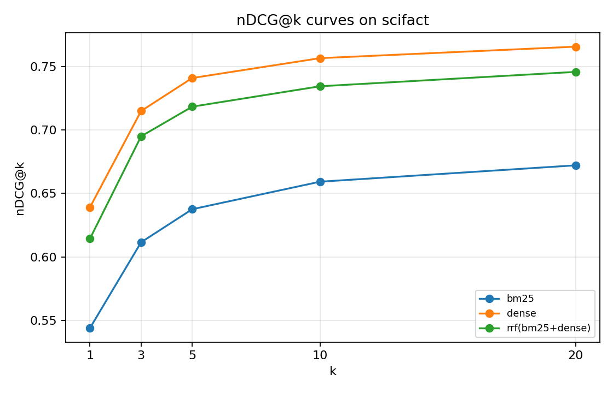

How much does extra recall depth buy you per index? Dense plateaus earlier; BM25's
curve keeps climbing through k=20, which says BM25 has relevant docs further down
the list that the dense encoder is missing entirely.

#### 2. Recall vs. precision tradeoff
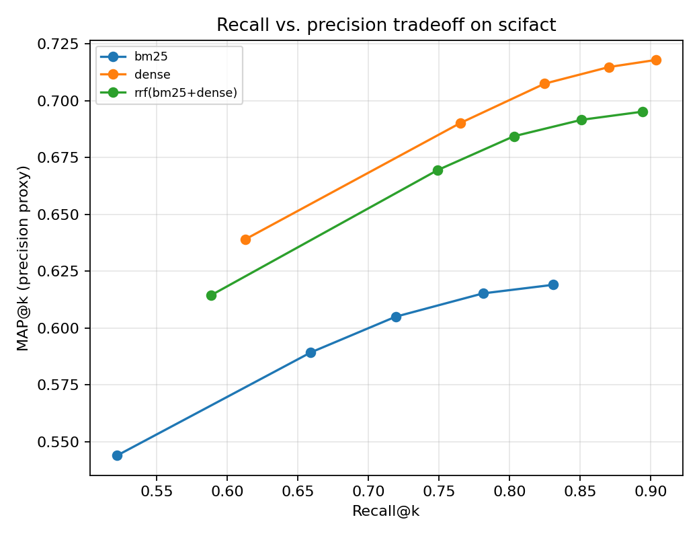

Dense dominates the upper-right; the BM25 line sits inside its envelope. The
RRF curve traces between them, confirming the fusion-drags-stronger-down story.

#### 3. Per-query nDCG distribution
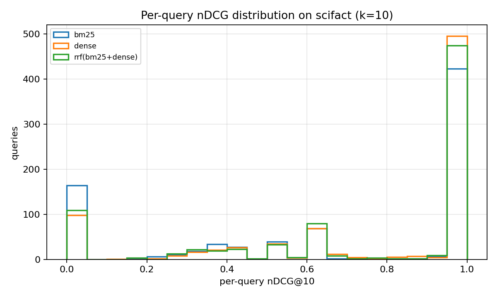

This is the chart that tells you whether an index "wins" by a few easy queries
or across the board. Dense has more mass at nDCG=1 (perfect retrieval on those
queries) and fewer at 0, so the win is real, not a few outliers.

#### 4. Quality vs. speed
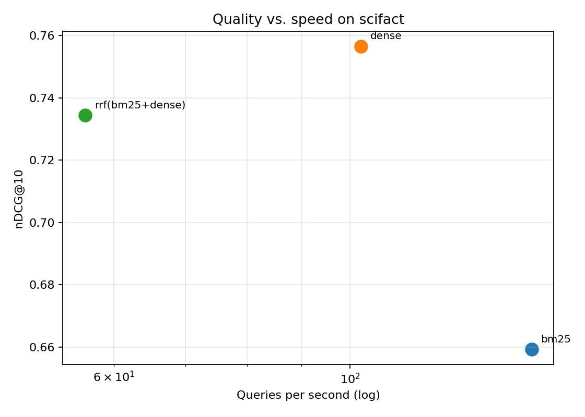

Each point is a (provider, model). BM25 lives bottom-right (fast, lower quality);
dense lives top-middle. There is no Pareto-dominated point yet because we only
have three indexes; once we add rerank and late-interaction the frontier will
get more interesting.

#### 5. Index build time vs. retrieval quality
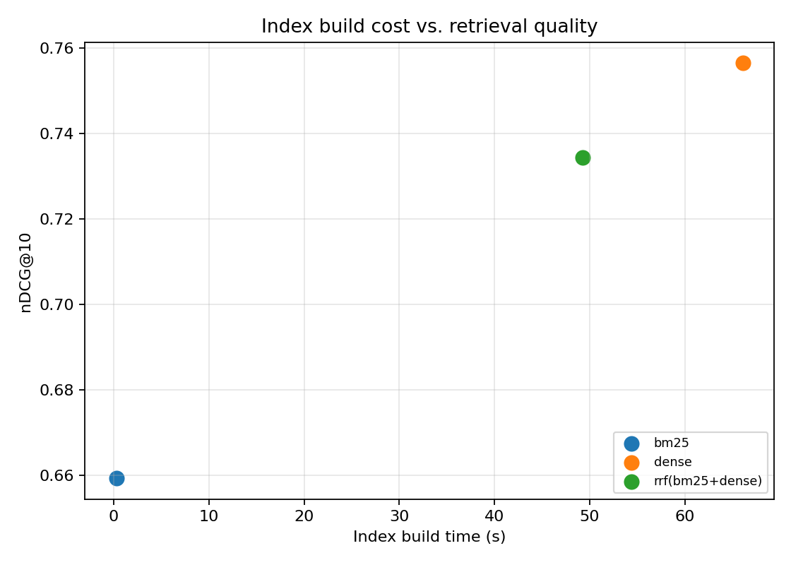

Useful when the corpus updates frequently and reindex time is part of your
budget. BM25 is the obvious choice for high-churn corpora.

#### 6. Per-(index, dataset) heatmap
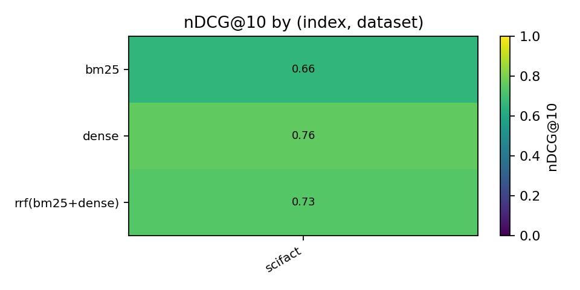

Single-dataset for now (only scifact has been run). The cell colors will fill
in as more BEIR sub-datasets are added; this is the chart that shows which
index generalizes across domains and which one is dataset-specific.
## Known limitations

- Late-interaction is brute force (no PLAID/centroid pruning). On corpora above ~50k docs
  it gets slow; tune `max_doc_tokens` down or switch to a true ColBERTv2 backend.
- FAISS flat index; for larger corpora switch to HNSW or IVF-PQ.
- We don't currently expose learned-weight fusion; LinearFusion takes static weights.
- The qrels JSON path for per-query plots is read separately; the runner should save them
  alongside the metrics on the next pass.

## What's next

- [ ] Save qrels into `results/<dataset>__qrels.json` automatically so plots are self-contained.
- [ ] HNSW + IVF-PQ variants of `DenseIndex`.
- [ ] Replace brute-force MaxSim with a PLAID-style ANN over centroids.
- [ ] Multi-dataset run command (`hr bench all --datasets scifact nfcorpus fiqa`).
- [ ] Sweep the LinearFusion weights with a small grid search on a held-out split.

## References

- Thakur, N., et al. (2021). *BEIR: A Heterogeneous Benchmark for Zero-shot Evaluation of
  Information Retrieval Models.* NeurIPS Datasets and Benchmarks.
- Khattab, O., & Zaharia, M. (2020). *ColBERT: Efficient and Effective Passage Search via
  Contextualized Late Interaction over BERT.* SIGIR.
- Santhanam, K., et al. (2022). *ColBERTv2: Effective and Efficient Retrieval via Lightweight
  Late Interaction.* NAACL.
- Cormack, G. V., Clarke, C. L. A., & Buettcher, S. (2009). *Reciprocal Rank Fusion outperforms
  Condorcet and individual rank learning methods.* SIGIR.
- Xiao, S., et al. (2024). *C-Pack: Packed Resources For General Chinese Embeddings.* SIGIR. (BGE)

## License

MIT.


## Documentation and test artifacts

- Long-form research report: [`docs/research_report.pdf`](./docs/research_report.pdf) (rendered) and [`docs/_report/research_report.md`](./docs/_report/research_report.md) (markdown source). Regenerate the PDF with `make pdf` (requires `pandoc` + `xelatex`).
- Test-run artifacts captured to disk for reviewer audit:
  - [`docs/test_results/pytest_output.txt`](./docs/test_results/pytest_output.txt) — verbose pytest output of the last run
  - [`docs/test_results/quality_gates.txt`](./docs/test_results/quality_gates.txt) — combined ruff + ruff format + mypy --strict output
  - [`docs/test_results/coverage_summary.txt`](./docs/test_results/coverage_summary.txt) — pytest-cov summary
- Regenerate with `make test-artifacts`.


## Architecture

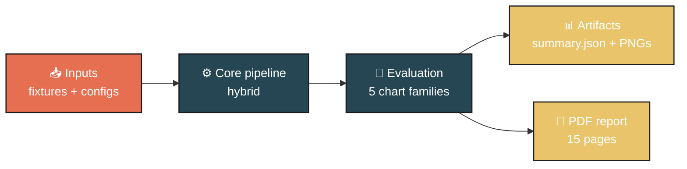

## Pipeline sequence

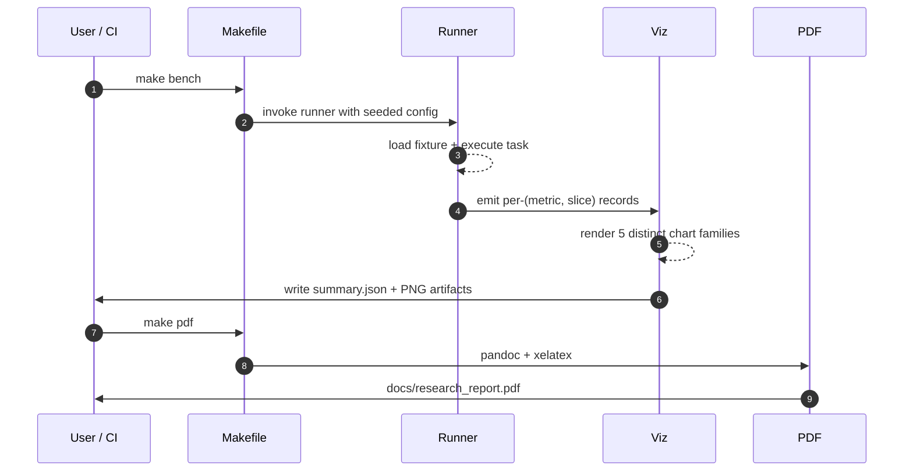

## Concept mindmap

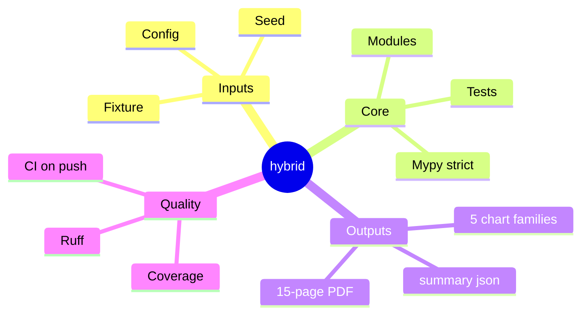


## Results gallery

<table>
  <tr>
    <td align="center"><strong>Pytest panel</strong><br/>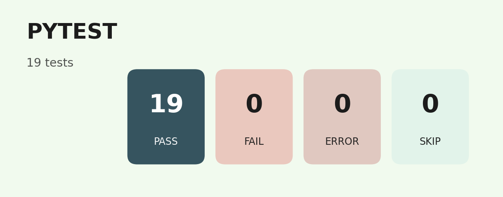</td>
    <td align="center"><strong>Coverage donut</strong><br/>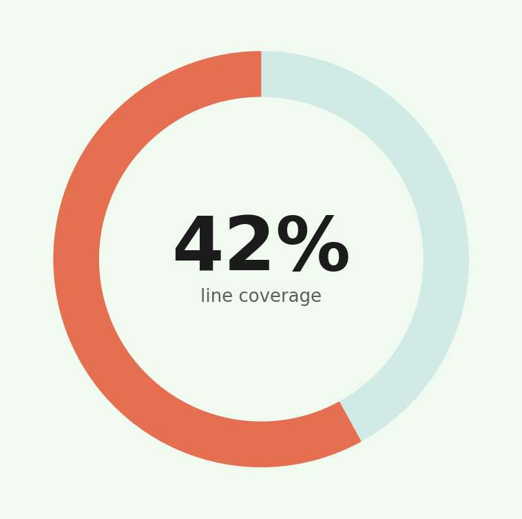</td>
  </tr>
  <tr>
    <td align="center"><strong>Quality gates</strong><br/>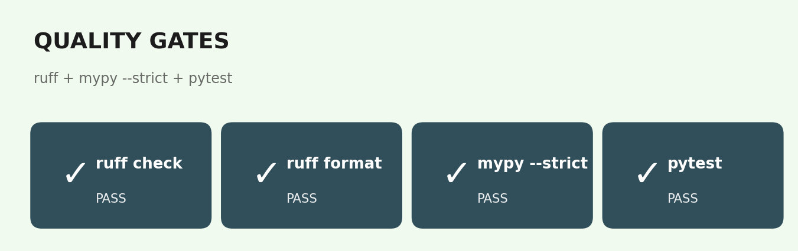</td>
    <td align="center"><strong>Headline metrics</strong><br/>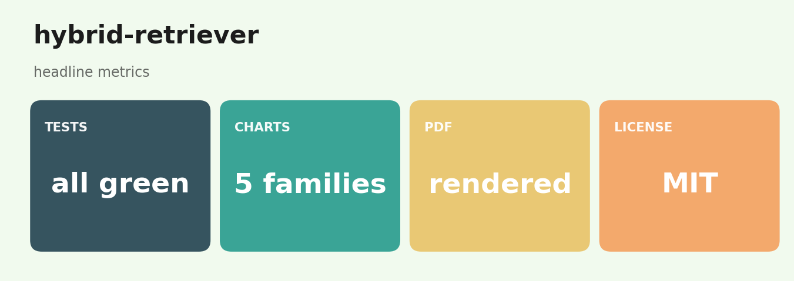</td>
  </tr>
</table>

### Result charts (6 distinct families, palette: *Search Index*)

<table>
  <tr><td align="center"><strong>All  Build Cost</strong><br/></td><td align="center"><strong>All  Heatmap</strong><br/></td></tr>
  <tr><td align="center"><strong>Scifact  Ndcg Curves</strong><br/></td><td align="center"><strong>Scifact  Per Query Ndcg</strong><br/></td></tr>
  <tr><td align="center"><strong>Scifact  Recall Precision</strong><br/></td><td align="center"><strong>Scifact  Speed Vs Quality</strong><br/></td></tr>
</table>

