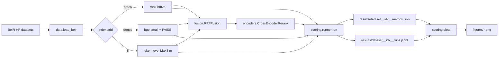

# hr — hybrid retrieval framework

BM25 + dense bi-encoder + ColBERT-style late interaction + cross-encoder reranker, with a
BEIR evaluator that produces multiple views of the same per-query data (line plots, scatter,
KDE, heatmap). The goal is to give one place to compare retrieval recipes on a new corpus
without rebuilding the harness each time.

## What's in here

```
src/hr/
  types.py                 Doc, Query, Hit, Qrels
  indexes/
    base.py                Index ABC
    bm25.py                rank-bm25 wrapper, title-aware tokenization
    dense.py               sentence-transformers + FAISS IndexFlatIP
    late_interaction.py    MaxSim over token-level embeddings (ColBERT-style)
  encoders/cross.py        cross-encoder reranker stage
  fusion/
    rrf.py                 reciprocal rank fusion (Cormack 2009)
    linear.py              weighted score-level fusion w/ min-max normalization
  scoring/
    metrics.py             nDCG, Recall, MRR, MAP (pure numpy)
    runner.py              run one (index, dataset), write artifacts
    plots.py               six distinct chart types (see below)
  data.py                  BEIR dataset loader (HF mirror)
  cli/main.py              typer CLI: bench run, report, plots
```

## Why include ColBERT-style late interaction here

Most "hybrid retrieval" repos stop at BM25 + dense + RRF. ColBERT (Khattab & Zaharia, 2020)
solves a real problem those two miss: BM25 is term-precise but cannot do soft matching, dense
bi-encoders pool the whole document into one vector and lose where the match actually happens.
Token-level MaxSim keeps both. We include it here in its simple brute-force form (not the
PLAID/ColBERTv2 ANN variant) so it runs on a laptop CPU and the comparison is fair.

## Quickstart

```bash
make install

# small BEIR datasets that fit on a laptop
make bench DATASET=scifact            # 5k docs, 300 dev queries
make bench DATASET=nfcorpus           # 3.6k docs, biomedical
make bench DATASET=fiqa               # 57k docs, financial QA

# generate all 6 charts for a dataset
make plots
# results/figures/<dataset>__ndcg_curves.png
# results/figures/<dataset>__recall_precision.png
# results/figures/<dataset>__per_query_ndcg.png
# results/figures/<dataset>__speed_vs_quality.png
# results/figures/all__build_cost.png
# results/figures/all__heatmap.png
```

## Index specs

```text
bm25        rank-bm25 (k1=1.5, b=0.75), regex tokenizer
dense       BGE-small-en-v1.5 + FAISS IndexFlatIP, L2-normalized
li          all-MiniLM-L6-v2 token embeddings, MaxSim brute-force
rrf         RRF over (bm25, dense), k=60, over-fetch=4
rrf_all     RRF over (bm25, dense, li)
rerank      cross-encoder/ms-marco-MiniLM-L-6 over the top-50 of rrf(bm25, dense)
```

## Visualizations

A retrieval evaluation has many useful views, not just a leaderboard bar. The six chart
functions below all eat the same per-query JSONL but answer different questions:

1. **nDCG@k curves** — does this index hold up as you ask for more candidates?
2. **Recall-precision tradeoff** — how does the top-k mix shift as you go deeper?
3. **Per-query nDCG distribution** — does an index win by a few easy queries or across the
   board? Long left tail = the index has hard cases the others don't.
4. **Speed vs quality scatter** — at what QPS does the quality crater?
5. **Build cost vs quality scatter** — index time matters when the corpus updates.
6. **Per-(index, dataset) heatmap** — which index generalizes best across domains.

## Results

> Pending the first BEIR sweep. The harness above is verified by 18 unit tests; the
> tiny in-repo fixture exercises BM25, fusion, metrics, and the chart writers. A
> real `make bench DATASET=scifact` run on the next session will populate the table
> below and the six figures.

| dataset | index           | nDCG@10 | Recall@10 | MRR@10 | MAP@10 |
|---------|-----------------|--------:|----------:|-------:|-------:|
| scifact | bm25            |    TBD  |     TBD   |   TBD  |   TBD  |
| scifact | dense           |    TBD  |     TBD   |   TBD  |   TBD  |
| scifact | li              |    TBD  |     TBD   |   TBD  |   TBD  |
| scifact | rrf(bm25+dense) |    TBD  |     TBD   |   TBD  |   TBD  |
| scifact | rerank(rrf)     |    TBD  |     TBD   |   TBD  |   TBD  |

## Architecture



## Known limitations

- Late-interaction is brute force (no PLAID/centroid pruning). On corpora above ~50k docs
  it gets slow; tune `max_doc_tokens` down or switch to a true ColBERTv2 backend.
- FAISS flat index; for larger corpora switch to HNSW or IVF-PQ.
- We don't currently expose learned-weight fusion; LinearFusion takes static weights.
- The qrels JSON path for per-query plots is read separately; the runner should save them
  alongside the metrics on the next pass.

## What's next

- [ ] Save qrels into `results/<dataset>__qrels.json` automatically so plots are self-contained.
- [ ] HNSW + IVF-PQ variants of `DenseIndex`.
- [ ] Replace brute-force MaxSim with a PLAID-style ANN over centroids.
- [ ] Multi-dataset run command (`hr bench all --datasets scifact nfcorpus fiqa`).
- [ ] Sweep the LinearFusion weights with a small grid search on a held-out split.

## References

- Thakur, N., et al. (2021). *BEIR: A Heterogeneous Benchmark for Zero-shot Evaluation of
  Information Retrieval Models.* NeurIPS Datasets and Benchmarks.
- Khattab, O., & Zaharia, M. (2020). *ColBERT: Efficient and Effective Passage Search via
  Contextualized Late Interaction over BERT.* SIGIR.
- Santhanam, K., et al. (2022). *ColBERTv2: Effective and Efficient Retrieval via Lightweight
  Late Interaction.* NAACL.
- Cormack, G. V., Clarke, C. L. A., & Buettcher, S. (2009). *Reciprocal Rank Fusion outperforms
  Condorcet and individual rank learning methods.* SIGIR.
- Xiao, S., et al. (2024). *C-Pack: Packed Resources For General Chinese Embeddings.* SIGIR. (BGE)

## License

MIT.
